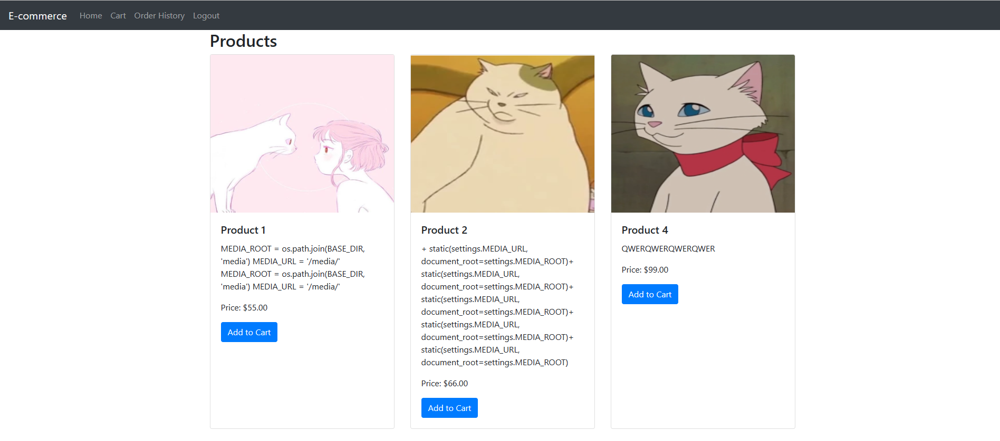
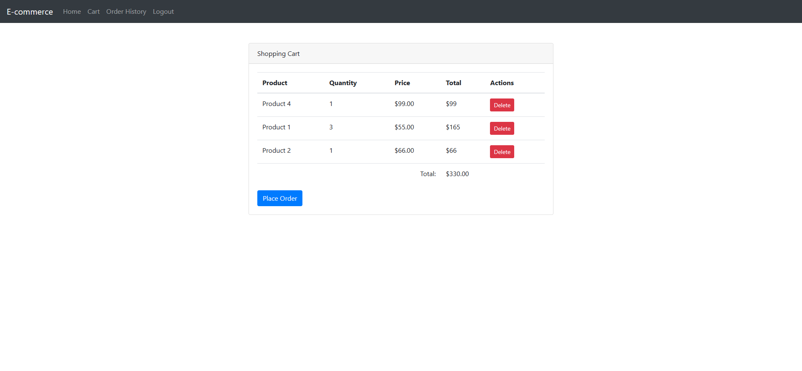
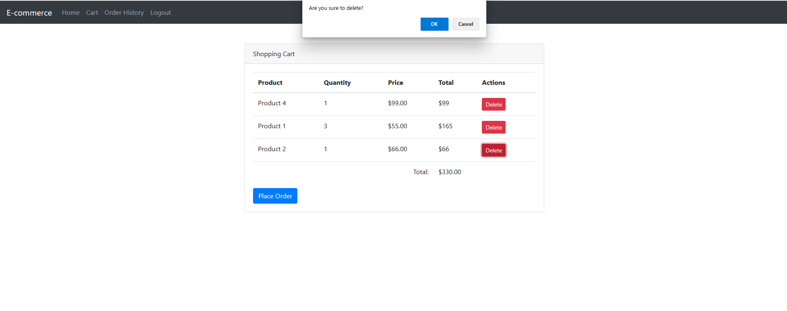
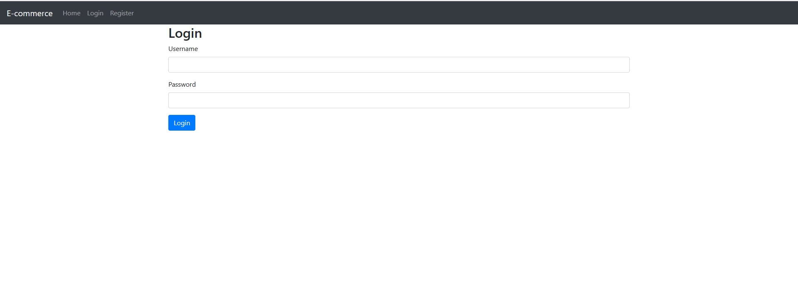
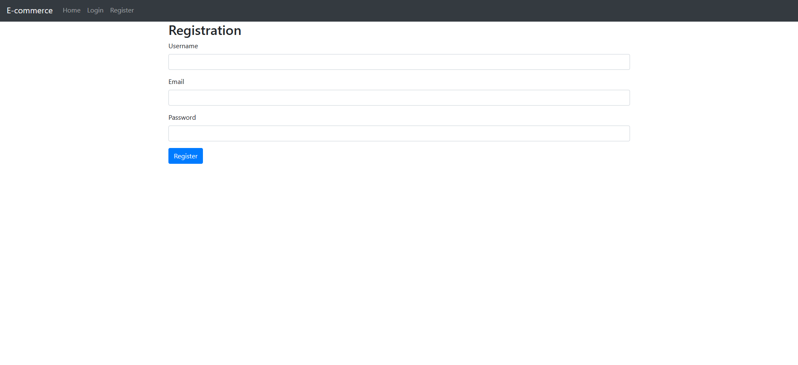
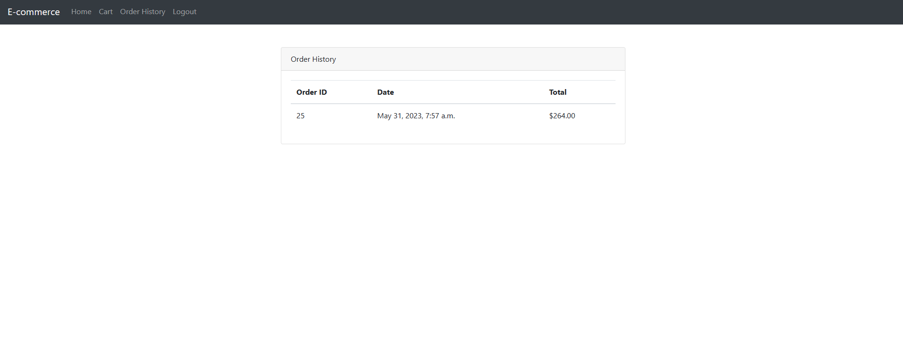
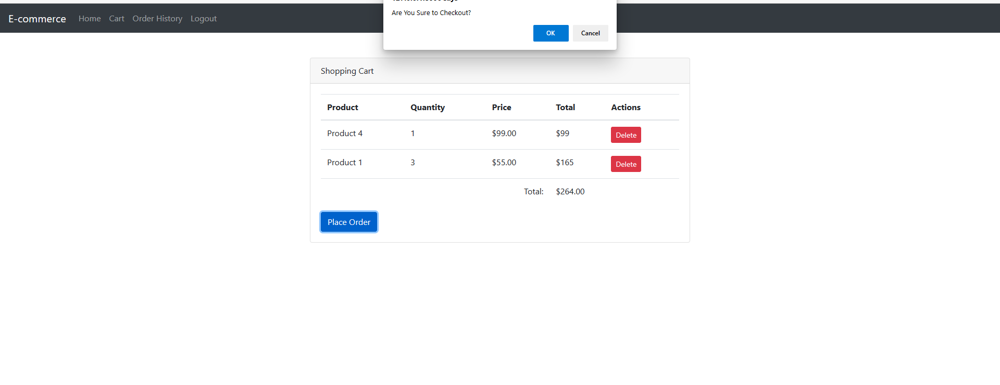

# E-Commerce
A simple e-commerce site built using Django and SQLite, it simulates basic Login/Registration/Add To Cart/Order History/Delete Item From A Cart/Checkout functionalities.

## Demo
* Home

* Add Item to Cart

* Cart View

* Delete Item

* Login

* Register

* Order History

* Checkout

## General Design Flow:
https://docs.google.com/document/d/151UgRyzX1GIQnWgQZXjd5QYPJwO0W-ZCCpm5zK5xot8/edit?usp=sharing

## System Setup
To run this project run the command 'pip install -r requirements.txt'
